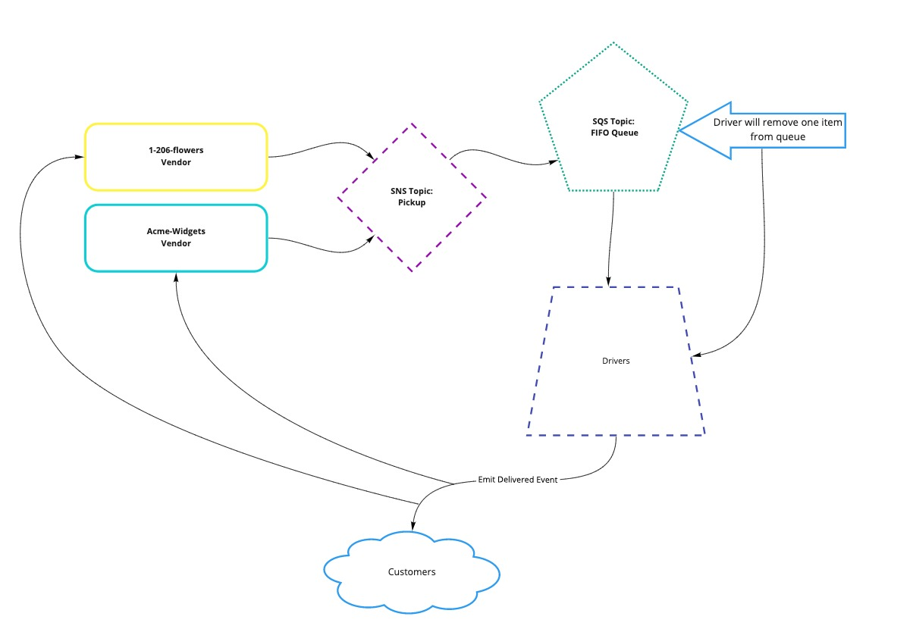
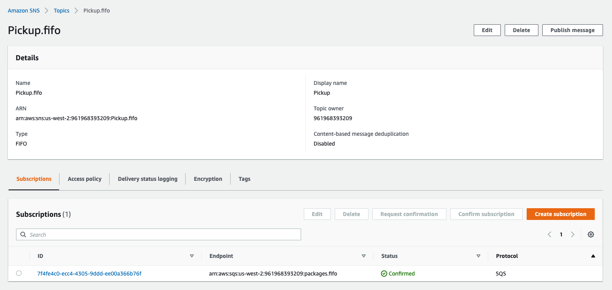
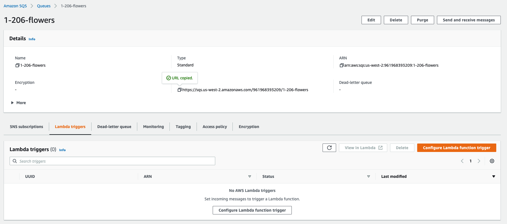

# Caps-Cloud

## Author: Jason Taisey

### Links & Resources

[Pull Request](https://github.com/JTaisey389/caps-cloud/pull/1)

### Feature Task

- Refer to the CAPS System Overview for a complete review of the application, including Business and Technical requirements along with the development roadmap.

- Required Services
  - SNS Topic: pickup which will receive all pickup requests from vendors
  - SQS Queue (FIFO): packages which will contain all delivery requests from vendors, in order of receipt.
  - Subscribe this queue to the pickup topic so all pickups are ordered
  - SQS Queue (Standard) for each vendor (named for the vendor) which will contain all delivery notifications from the drivers

### Overview

- The concept of this lab is to convert our CAPS project into a serverless set of function. We were tasked to integrate two new parts of AWS which included SQS(Simple Queueing Server) and SNS(Simple Notification System). The SNS portion would handle all the PUB/SUB events that are pushed out by the vendors at the set intervals. Those are then pushed into the queueing service which maintains a set order for each of the payloads. From there the payloads are "picked up" by the drivers and delivered to the customers. That in a high overview is the implementation of the lab and integrating it within AWS.

### UML

### Images

### Collaborations

- Nicki Baldwin
- Simone Odegard
- Jessi Velazquez
